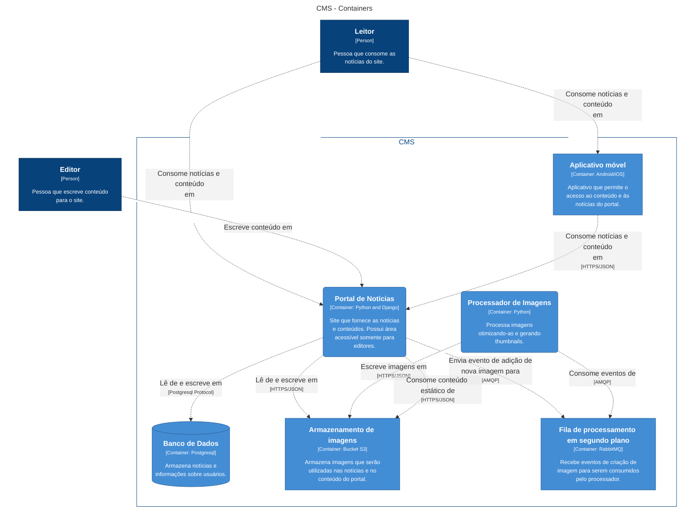
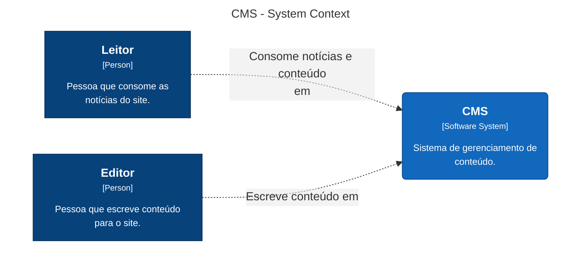

## Containers

```mermaid
graph LR
  linkStyle default fill:#ffffff

  subgraph diagram ["CMS - Containers"]
    style diagram fill:#ffffff,stroke:#ffffff

    1["<div style='font-weight: bold'>Leitor</div><div style='font-size: 70%; margin-top: 0px'>[Person]</div><div style='font-size: 80%; margin-top:10px'>Pessoa que consome as<br />notícias do site.</div>"]
    style 1 fill:#08427b,stroke:#052e56,color:#ffffff
    2["<div style='font-weight: bold'>Editor</div><div style='font-size: 70%; margin-top: 0px'>[Person]</div><div style='font-size: 80%; margin-top:10px'>Pessoa que escreve conteúdo<br />para o site.</div>"]
    style 2 fill:#08427b,stroke:#052e56,color:#ffffff

    subgraph 3 [CMS]
      style 3 fill:#ffffff,stroke:#0b4884,color:#0b4884

      4("<div style='font-weight: bold'>Portal de Notícias</div><div style='font-size: 70%; margin-top: 0px'>[Container: Python and Django]</div><div style='font-size: 80%; margin-top:10px'>Site que fornece as notícias<br />e conteúdos. Possui área<br />acessível somente para<br />editores.</div>")
      style 4 fill:#438dd5,stroke:#2e6295,color:#ffffff
      5[("<div style='font-weight: bold'>Banco de Dados</div><div style='font-size: 70%; margin-top: 0px'>[Container: Postgresql]</div><div style='font-size: 80%; margin-top:10px'>Armazena notícias e<br />informações sobre usuários.</div>")]
      style 5 fill:#438dd5,stroke:#2e6295,color:#ffffff
      6["<div style='font-weight: bold'>Armazenamento de imagens</div><div style='font-size: 70%; margin-top: 0px'>[Container: Bucket S3]</div><div style='font-size: 80%; margin-top:10px'>Armazena imagens que serão<br />utilizadas nas notícias e no<br />conteúdo do portal.</div>"]
      style 6 fill:#438dd5,stroke:#2e6295,color:#ffffff
      7["<div style='font-weight: bold'>Aplicativo móvel</div><div style='font-size: 70%; margin-top: 0px'>[Container: Android/iOS]</div><div style='font-size: 80%; margin-top:10px'>Aplicativo que permite o<br />acesso ao conteúdo e às<br />notícias do portal.</div>"]
      style 7 fill:#438dd5,stroke:#2e6295,color:#ffffff
      8["<div style='font-weight: bold'>Fila de processamento em segundo plano</div><div style='font-size: 70%; margin-top: 0px'>[Container: RabbitMQ]</div><div style='font-size: 80%; margin-top:10px'>Recebe eventos de criação de<br />imagem para serem consumidos<br />pelo processador.</div>"]
      style 8 fill:#438dd5,stroke:#2e6295,color:#ffffff
      9("<div style='font-weight: bold'>Processador de Imagens</div><div style='font-size: 70%; margin-top: 0px'>[Container: Python]</div><div style='font-size: 80%; margin-top:10px'>Processa imagens<br />otimizando-as e gerando<br />thumbnails.</div>")
      style 9 fill:#438dd5,stroke:#2e6295,color:#ffffff
    end

    1-. "<div>Consome notícias e conteúdo<br />em</div><div style='font-size: 70%'></div>" .->4
    1-. "<div>Consome notícias e conteúdo<br />em</div><div style='font-size: 70%'></div>" .->7
    2-. "<div>Escreve conteúdo em</div><div style='font-size: 70%'></div>" .->4
    7-. "<div>Consome notícias e conteúdo<br />em</div><div style='font-size: 70%'>[HTTPS/JSON]</div>" .->4
    4-. "<div>Lê de e escreve em</div><div style='font-size: 70%'>[Postgresql Protocol]</div>" .->5
    4-. "<div>Lê de e escreve em</div><div style='font-size: 70%'>[HTTPS/JSON]</div>" .->6
    4-. "<div>Envia evento de adição de<br />nova imagem para</div><div style='font-size: 70%'>[AMQP]</div>" .->8
    9-. "<div>Consome eventos de</div><div style='font-size: 70%'>[AMQP]</div>" .->8
    9-. "<div>Escreve imagens em</div><div style='font-size: 70%'>[HTTPS/JSON]</div>" .->6
    4-. "<div>Consome conteúdo estático de</div><div style='font-size: 70%'>[HTTPS/JSON]</div>" .->6
  end
```

## SystemContext

```mermaid
graph TB
  linkStyle default fill:#ffffff

  subgraph diagram ["CMS - System Context"]
    style diagram fill:#ffffff,stroke:#ffffff

    1["<div style='font-weight: bold'>Leitor</div><div style='font-size: 70%; margin-top: 0px'>[Person]</div><div style='font-size: 80%; margin-top:10px'>Pessoa que consome as<br />notícias do site.</div>"]
    style 1 fill:#08427b,stroke:#052e56,color:#ffffff
    2["<div style='font-weight: bold'>Editor</div><div style='font-size: 70%; margin-top: 0px'>[Person]</div><div style='font-size: 80%; margin-top:10px'>Pessoa que escreve conteúdo<br />para o site.</div>"]
    style 2 fill:#08427b,stroke:#052e56,color:#ffffff
    3("<div style='font-weight: bold'>CMS</div><div style='font-size: 70%; margin-top: 0px'>[Software System]</div><div style='font-size: 80%; margin-top:10px'>Sistema de gerenciamento de<br />conteúdo.</div>")
    style 3 fill:#1168bd,stroke:#0b4884,color:#ffffff

    1-. "<div>Consome notícias e conteúdo<br />em</div><div style='font-size: 70%'></div>" .->3
    2-. "<div>Escreve conteúdo em</div><div style='font-size: 70%'></div>" .->3
  end
```

