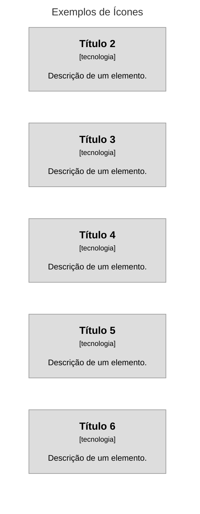

## Icones

```mermaid
graph TB
  linkStyle default fill:#ffffff

  subgraph diagram ["Exemplos de Ícones"]
    style diagram fill:#ffffff,stroke:#ffffff

    1["<div style='font-weight: bold'>Título 2</div><div style='font-size: 70%; margin-top: 0px'>[tecnologia]</div><div style='font-size: 80%; margin-top:10px'>Descrição de um elemento.</div>"]
    style 1 fill:#dddddd,stroke:#9a9a9a,color:#000000
    2["<div style='font-weight: bold'>Título 3</div><div style='font-size: 70%; margin-top: 0px'>[tecnologia]</div><div style='font-size: 80%; margin-top:10px'>Descrição de um elemento.</div>"]
    style 2 fill:#dddddd,stroke:#9a9a9a,color:#000000
    3["<div style='font-weight: bold'>Título 4</div><div style='font-size: 70%; margin-top: 0px'>[tecnologia]</div><div style='font-size: 80%; margin-top:10px'>Descrição de um elemento.</div>"]
    style 3 fill:#dddddd,stroke:#9a9a9a,color:#000000
    4["<div style='font-weight: bold'>Título 5</div><div style='font-size: 70%; margin-top: 0px'>[tecnologia]</div><div style='font-size: 80%; margin-top:10px'>Descrição de um elemento.</div>"]
    style 4 fill:#dddddd,stroke:#9a9a9a,color:#000000
    5["<div style='font-weight: bold'>Título 6</div><div style='font-size: 70%; margin-top: 0px'>[tecnologia]</div><div style='font-size: 80%; margin-top:10px'>Descrição de um elemento.</div>"]
    style 5 fill:#dddddd,stroke:#9a9a9a,color:#000000

  end
```

