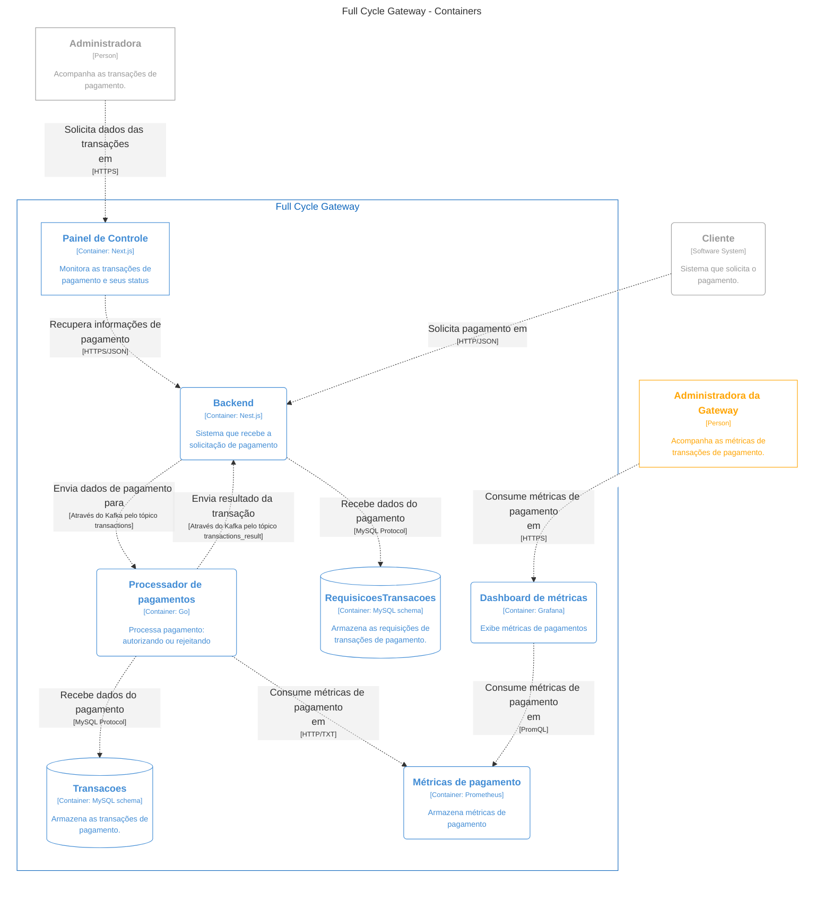
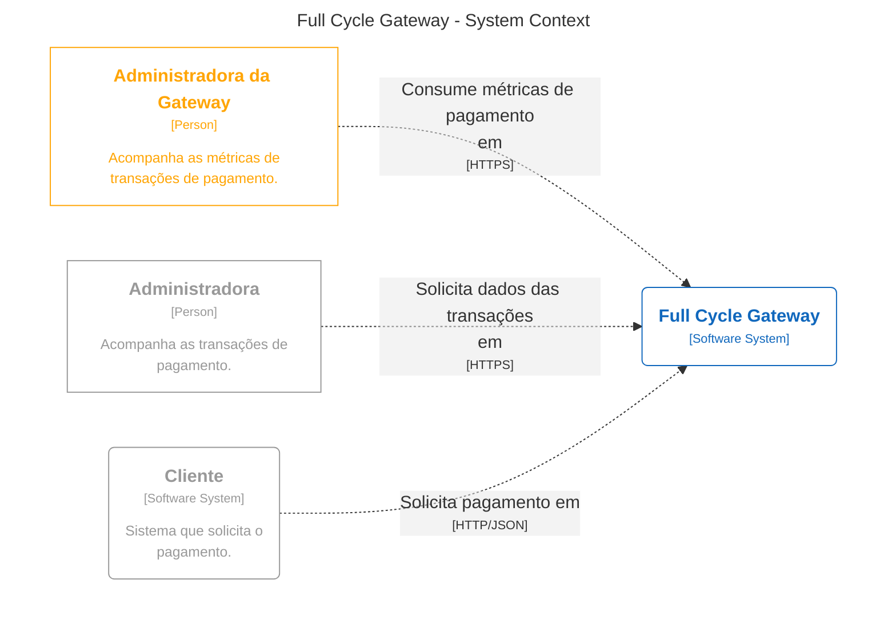
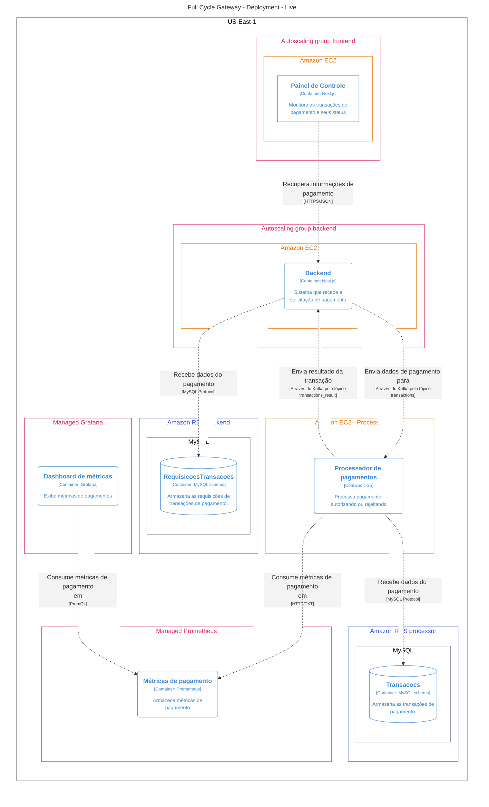

## ContainerDiagram

```mermaid
graph LR
  linkStyle default fill:#ffffff

  subgraph diagram ["Full Cycle Gateway - Containers"]
    style diagram fill:#ffffff,stroke:#ffffff

    1("<div style='font-weight: bold'>Cliente</div><div style='font-size: 70%; margin-top: 0px'>[Software System]</div><div style='font-size: 80%; margin-top:10px'>Sistema que solicita o<br />pagamento.</div>")
    style 1 fill:#ffffff,stroke:#999999,color:#999999
    2["<div style='font-weight: bold'>Administradora</div><div style='font-size: 70%; margin-top: 0px'>[Person]</div><div style='font-size: 80%; margin-top:10px'>Acompanha as transações de<br />pagamento.</div>"]
    style 2 fill:#ffffff,stroke:#999999,color:#999999
    3["<div style='font-weight: bold'>Administradora da Gateway</div><div style='font-size: 70%; margin-top: 0px'>[Person]</div><div style='font-size: 80%; margin-top:10px'>Acompanha as métricas de<br />transações de pagamento.</div>"]
    style 3 fill:#ffffff,stroke:#ffa505,color:#ffa505

    subgraph 4 [Full Cycle Gateway]
      style 4 fill:#ffffff,stroke:#1168bd,color:#1168bd

      11[("<div style='font-weight: bold'>RequisicoesTransacoes</div><div style='font-size: 70%; margin-top: 0px'>[Container: MySQL schema]</div><div style='font-size: 80%; margin-top:10px'>Armazena as requisições de<br />transações de pagamento.</div>")]
      style 11 fill:#ffffff,stroke:#438dd5,color:#438dd5
      13[("<div style='font-weight: bold'>Transacoes</div><div style='font-size: 70%; margin-top: 0px'>[Container: MySQL schema]</div><div style='font-size: 80%; margin-top:10px'>Armazena as transações de<br />pagamento.</div>")]
      style 13 fill:#ffffff,stroke:#438dd5,color:#438dd5
      15("<div style='font-weight: bold'>Métricas de pagamento</div><div style='font-size: 70%; margin-top: 0px'>[Container: Prometheus]</div><div style='font-size: 80%; margin-top:10px'>Armazena métricas de<br />pagamento</div>")
      style 15 fill:#ffffff,stroke:#438dd5,color:#438dd5
      17("<div style='font-weight: bold'>Dashboard de métricas</div><div style='font-size: 70%; margin-top: 0px'>[Container: Grafana]</div><div style='font-size: 80%; margin-top:10px'>Exibe métricas de pagamentos</div>")
      style 17 fill:#ffffff,stroke:#438dd5,color:#438dd5
      21["<div style='font-weight: bold'>Painel de Controle</div><div style='font-size: 70%; margin-top: 0px'>[Container: Next.js]</div><div style='font-size: 80%; margin-top:10px'>Monitora as transações de<br />pagamento e seus status</div>"]
      style 21 fill:#ffffff,stroke:#438dd5,color:#438dd5
      5("<div style='font-weight: bold'>Backend</div><div style='font-size: 70%; margin-top: 0px'>[Container: Nest.js]</div><div style='font-size: 80%; margin-top:10px'>Sistema que recebe a<br />solicitação de pagamento</div>")
      style 5 fill:#ffffff,stroke:#438dd5,color:#438dd5
      8("<div style='font-weight: bold'>Processador de pagamentos</div><div style='font-size: 70%; margin-top: 0px'>[Container: Go]</div><div style='font-size: 80%; margin-top:10px'>Processa pagamento:<br />autorizando ou rejeitando</div>")
      style 8 fill:#ffffff,stroke:#438dd5,color:#438dd5
    end

    8-. "<div>Envia resultado da transação</div><div style='font-size: 70%'>[Através do Kafka pelo tópico transactions_result]</div>" .->5
    5-. "<div>Recebe dados do pagamento</div><div style='font-size: 70%'>[MySQL Protocol]</div>" .->11
    8-. "<div>Recebe dados do pagamento</div><div style='font-size: 70%'>[MySQL Protocol]</div>" .->13
    8-. "<div>Consume métricas de pagamento<br />em</div><div style='font-size: 70%'>[HTTP/TXT]</div>" .->15
    17-. "<div>Consume métricas de pagamento<br />em</div><div style='font-size: 70%'>[PromQL]</div>" .->15
    3-. "<div>Consume métricas de pagamento<br />em</div><div style='font-size: 70%'>[HTTPS]</div>" .->17
    2-. "<div>Solicita dados das transações<br />em</div><div style='font-size: 70%'>[HTTPS]</div>" .->21
    21-. "<div>Recupera informações de<br />pagamento</div><div style='font-size: 70%'>[HTTPS/JSON]</div>" .->5
    1-. "<div>Solicita pagamento em</div><div style='font-size: 70%'>[HTTP/JSON]</div>" .->5
    5-. "<div>Envia dados de pagamento para</div><div style='font-size: 70%'>[Através do Kafka pelo tópico transactions]</div>" .->8
  end
```

## ContextDiagram

```mermaid
graph TB
  linkStyle default fill:#ffffff

  subgraph diagram ["Full Cycle Gateway - System Context"]
    style diagram fill:#ffffff,stroke:#ffffff

    1("<div style='font-weight: bold'>Cliente</div><div style='font-size: 70%; margin-top: 0px'>[Software System]</div><div style='font-size: 80%; margin-top:10px'>Sistema que solicita o<br />pagamento.</div>")
    style 1 fill:#ffffff,stroke:#999999,color:#999999
    2["<div style='font-weight: bold'>Administradora</div><div style='font-size: 70%; margin-top: 0px'>[Person]</div><div style='font-size: 80%; margin-top:10px'>Acompanha as transações de<br />pagamento.</div>"]
    style 2 fill:#ffffff,stroke:#999999,color:#999999
    3["<div style='font-weight: bold'>Administradora da Gateway</div><div style='font-size: 70%; margin-top: 0px'>[Person]</div><div style='font-size: 80%; margin-top:10px'>Acompanha as métricas de<br />transações de pagamento.</div>"]
    style 3 fill:#ffffff,stroke:#ffa505,color:#ffa505
    4("<div style='font-weight: bold'>Full Cycle Gateway</div><div style='font-size: 70%; margin-top: 0px'>[Software System]</div>")
    style 4 fill:#ffffff,stroke:#1168bd,color:#1168bd

    3-. "<div>Consume métricas de pagamento<br />em</div><div style='font-size: 70%'>[HTTPS]</div>" .->4
    2-. "<div>Solicita dados das transações<br />em</div><div style='font-size: 70%'>[HTTPS]</div>" .->4
    1-. "<div>Solicita pagamento em</div><div style='font-size: 70%'>[HTTP/JSON]</div>" .->4
  end
```

## LiveDeployment

```mermaid
graph LR
  linkStyle default fill:#ffffff

  subgraph diagram ["Full Cycle Gateway - Deployment - Live"]
    style diagram fill:#ffffff,stroke:#ffffff

    subgraph 25 [US-East-1]
      style 25 fill:#ffffff,stroke:#888888,color:#000000

      subgraph 26 [Autoscaling group frontend]
        style 26 fill:#ffffff,stroke:#da2e6e,color:#da2e6e

        subgraph 27 [Amazon EC2]
          style 27 fill:#ffffff,stroke:#e5770d,color:#e5770d

          28["<div style='font-weight: bold'>Painel de Controle</div><div style='font-size: 70%; margin-top: 0px'>[Container: Next.js]</div><div style='font-size: 80%; margin-top:10px'>Monitora as transações de<br />pagamento e seus status</div>"]
          style 28 fill:#ffffff,stroke:#438dd5,color:#438dd5
        end

      end

      subgraph 29 [Autoscaling group backend]
        style 29 fill:#ffffff,stroke:#da2e6e,color:#da2e6e

        subgraph 30 [Amazon EC2]
          style 30 fill:#ffffff,stroke:#e5770d,color:#e5770d

          31("<div style='font-weight: bold'>Backend</div><div style='font-size: 70%; margin-top: 0px'>[Container: Nest.js]</div><div style='font-size: 80%; margin-top:10px'>Sistema que recebe a<br />solicitação de pagamento</div>")
          style 31 fill:#ffffff,stroke:#438dd5,color:#438dd5
        end

      end

      subgraph 33 [Amazon EC2 - Processor]
        style 33 fill:#ffffff,stroke:#e5770d,color:#e5770d

        34("<div style='font-weight: bold'>Processador de pagamentos</div><div style='font-size: 70%; margin-top: 0px'>[Container: Go]</div><div style='font-size: 80%; margin-top:10px'>Processa pagamento:<br />autorizando ou rejeitando</div>")
        style 34 fill:#ffffff,stroke:#438dd5,color:#438dd5
      end

      subgraph 37 [Managed Grafana]
        style 37 fill:#ffffff,stroke:#d72b6c,color:#d72b6c

        38("<div style='font-weight: bold'>Dashboard de métricas</div><div style='font-size: 70%; margin-top: 0px'>[Container: Grafana]</div><div style='font-size: 80%; margin-top:10px'>Exibe métricas de pagamentos</div>")
        style 38 fill:#ffffff,stroke:#438dd5,color:#438dd5
      end

      subgraph 39 [Managed Prometheus]
        style 39 fill:#ffffff,stroke:#da2e6e,color:#da2e6e

        40("<div style='font-weight: bold'>Métricas de pagamento</div><div style='font-size: 70%; margin-top: 0px'>[Container: Prometheus]</div><div style='font-size: 80%; margin-top:10px'>Armazena métricas de<br />pagamento</div>")
        style 40 fill:#ffffff,stroke:#438dd5,color:#438dd5
      end

      subgraph 43 [Amazon RDS backend]
        style 43 fill:#ffffff,stroke:#3f51d4,color:#3f51d4

        subgraph 44 [MySQL]
          style 44 fill:#ffffff,stroke:#888888,color:#000000

          45[("<div style='font-weight: bold'>RequisicoesTransacoes</div><div style='font-size: 70%; margin-top: 0px'>[Container: MySQL schema]</div><div style='font-size: 80%; margin-top:10px'>Armazena as requisições de<br />transações de pagamento.</div>")]
          style 45 fill:#ffffff,stroke:#438dd5,color:#438dd5
        end

      end

      subgraph 47 [Amazon RDS processor]
        style 47 fill:#ffffff,stroke:#3f51d4,color:#3f51d4

        subgraph 48 [MySQL]
          style 48 fill:#ffffff,stroke:#888888,color:#000000

          49[("<div style='font-weight: bold'>Transacoes</div><div style='font-size: 70%; margin-top: 0px'>[Container: MySQL schema]</div><div style='font-size: 80%; margin-top:10px'>Armazena as transações de<br />pagamento.</div>")]
          style 49 fill:#ffffff,stroke:#438dd5,color:#438dd5
        end

      end

    end

    28-. "<div>Recupera informações de<br />pagamento</div><div style='font-size: 70%'>[HTTPS/JSON]</div>" .->31
    34-. "<div>Envia resultado da transação</div><div style='font-size: 70%'>[Através do Kafka pelo tópico transactions_result]</div>" .->31
    31-. "<div>Envia dados de pagamento para</div><div style='font-size: 70%'>[Através do Kafka pelo tópico transactions]</div>" .->34
    34-. "<div>Consume métricas de pagamento<br />em</div><div style='font-size: 70%'>[HTTP/TXT]</div>" .->40
    38-. "<div>Consume métricas de pagamento<br />em</div><div style='font-size: 70%'>[PromQL]</div>" .->40
    31-. "<div>Recebe dados do pagamento</div><div style='font-size: 70%'>[MySQL Protocol]</div>" .->45
    34-. "<div>Recebe dados do pagamento</div><div style='font-size: 70%'>[MySQL Protocol]</div>" .->49
  end
```

