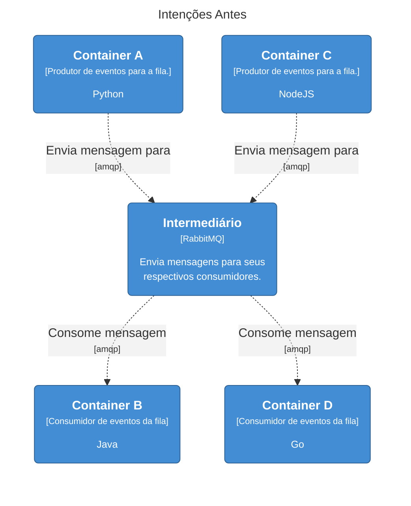
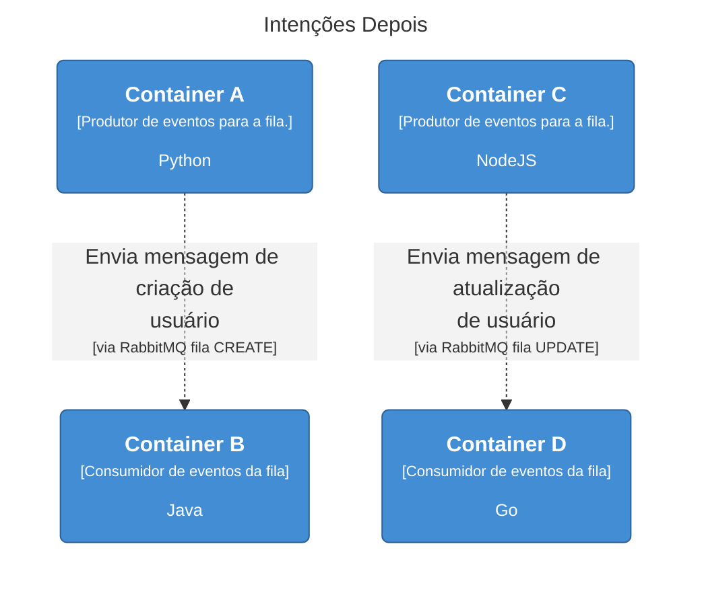

## IntencoesAntes

```mermaid
graph LR
  linkStyle default fill:#ffffff

  subgraph diagram ["Intenções Antes"]
    style diagram fill:#ffffff,stroke:#ffffff

    1("<div style='font-weight: bold'>Container A</div><div style='font-size: 70%; margin-top: 0px'>[Produtor de eventos para a fila.]</div><div style='font-size: 80%; margin-top:10px'>Python</div>")
    style 1 fill:#438dd5,stroke:#2e6295,color:#ffffff
    2("<div style='font-weight: bold'>Container B</div><div style='font-size: 70%; margin-top: 0px'>[Consumidor de eventos da fila]</div><div style='font-size: 80%; margin-top:10px'>Java</div>")
    style 2 fill:#438dd5,stroke:#2e6295,color:#ffffff
    3("<div style='font-weight: bold'>Container C</div><div style='font-size: 70%; margin-top: 0px'>[Produtor de eventos para a fila.]</div><div style='font-size: 80%; margin-top:10px'>NodeJS</div>")
    style 3 fill:#438dd5,stroke:#2e6295,color:#ffffff
    4("<div style='font-weight: bold'>Container D</div><div style='font-size: 70%; margin-top: 0px'>[Consumidor de eventos da fila]</div><div style='font-size: 80%; margin-top:10px'>Go</div>")
    style 4 fill:#438dd5,stroke:#2e6295,color:#ffffff
    5("<div style='font-weight: bold'>Intermediário</div><div style='font-size: 70%; margin-top: 0px'>[RabbitMQ]</div><div style='font-size: 80%; margin-top:10px'>Envia mensagens para seus<br />respectivos consumidores.</div>")
    style 5 fill:#438dd5,stroke:#2e6295,color:#ffffff

    1-. "<div>Envia mensagem para</div><div style='font-size: 70%'>[amqp]</div>" .->5
    3-. "<div>Envia mensagem para</div><div style='font-size: 70%'>[amqp]</div>" .->5
    5-. "<div>Consome mensagem</div><div style='font-size: 70%'>[amqp]</div>" .->2
    5-. "<div>Consome mensagem</div><div style='font-size: 70%'>[amqp]</div>" .->4
  end
```

## IntencoesDepois

```mermaid
graph LR
  linkStyle default fill:#ffffff

  subgraph diagram ["Intenções Depois"]
    style diagram fill:#ffffff,stroke:#ffffff

    1("<div style='font-weight: bold'>Container A</div><div style='font-size: 70%; margin-top: 0px'>[Produtor de eventos para a fila.]</div><div style='font-size: 80%; margin-top:10px'>Python</div>")
    style 1 fill:#438dd5,stroke:#2e6295,color:#ffffff
    2("<div style='font-weight: bold'>Container B</div><div style='font-size: 70%; margin-top: 0px'>[Consumidor de eventos da fila]</div><div style='font-size: 80%; margin-top:10px'>Java</div>")
    style 2 fill:#438dd5,stroke:#2e6295,color:#ffffff
    3("<div style='font-weight: bold'>Container C</div><div style='font-size: 70%; margin-top: 0px'>[Produtor de eventos para a fila.]</div><div style='font-size: 80%; margin-top:10px'>NodeJS</div>")
    style 3 fill:#438dd5,stroke:#2e6295,color:#ffffff
    4("<div style='font-weight: bold'>Container D</div><div style='font-size: 70%; margin-top: 0px'>[Consumidor de eventos da fila]</div><div style='font-size: 80%; margin-top:10px'>Go</div>")
    style 4 fill:#438dd5,stroke:#2e6295,color:#ffffff

    1-. "<div>Envia mensagem de criação de<br />usuário</div><div style='font-size: 70%'>[via RabbitMQ fila CREATE]</div>" .->2
    3-. "<div>Envia mensagem de atualização<br />de usuário</div><div style='font-size: 70%'>[via RabbitMQ fila UPDATE]</div>" .->4
  end
```

