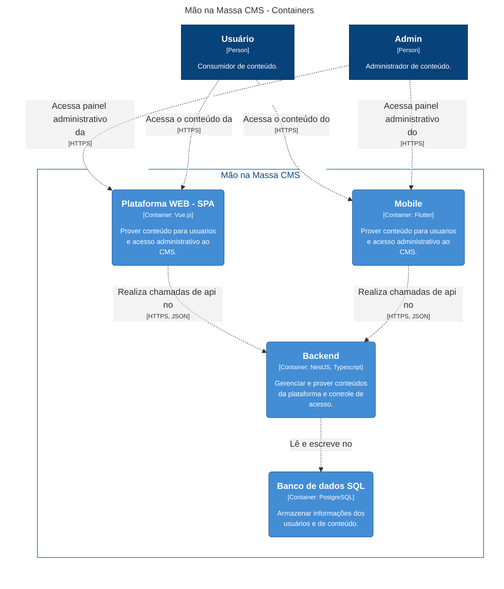
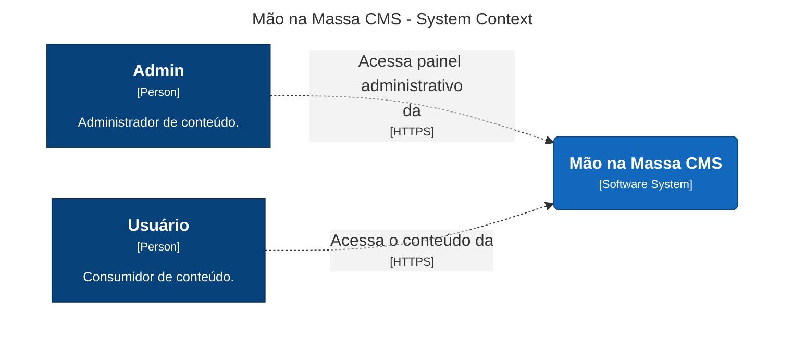

## ContainerDiagram

```mermaid
graph LR
  linkStyle default fill:#ffffff

  subgraph diagram ["Mão na Massa CMS - Containers"]
    style diagram fill:#ffffff,stroke:#ffffff

    1["<div style='font-weight: bold'>Usuário</div><div style='font-size: 70%; margin-top: 0px'>[Person]</div><div style='font-size: 80%; margin-top:10px'>Consumidor de conteúdo.</div>"]
    style 1 fill:#08427b,stroke:#052e56,color:#ffffff
    2["<div style='font-weight: bold'>Admin</div><div style='font-size: 70%; margin-top: 0px'>[Person]</div><div style='font-size: 80%; margin-top:10px'>Administrador de conteúdo.</div>"]
    style 2 fill:#08427b,stroke:#052e56,color:#ffffff

    subgraph 3 [Mão na Massa CMS]
      style 3 fill:#ffffff,stroke:#0b4884,color:#0b4884

      4("<div style='font-weight: bold'>Plataforma WEB - SPA</div><div style='font-size: 70%; margin-top: 0px'>[Container: Vue.js]</div><div style='font-size: 80%; margin-top:10px'>Prover conteúdo para usuarios<br />e acesso administrativo ao<br />CMS.</div>")
      style 4 fill:#438dd5,stroke:#2e6295,color:#ffffff
      5("<div style='font-weight: bold'>Mobile</div><div style='font-size: 70%; margin-top: 0px'>[Container: Flutter]</div><div style='font-size: 80%; margin-top:10px'>Prover conteúdo para usuarios<br />e acesso administrativo ao<br />CMS.</div>")
      style 5 fill:#438dd5,stroke:#2e6295,color:#ffffff
      6("<div style='font-weight: bold'>Backend</div><div style='font-size: 70%; margin-top: 0px'>[Container: NestJS, Typescript]</div><div style='font-size: 80%; margin-top:10px'>Gerenciar e prover conteúdos<br />da plataforma e controle de<br />acesso.</div>")
      style 6 fill:#438dd5,stroke:#2e6295,color:#ffffff
      7("<div style='font-weight: bold'>Banco de dados SQL</div><div style='font-size: 70%; margin-top: 0px'>[Container: PostgreSQL]</div><div style='font-size: 80%; margin-top:10px'>Armazenar informações dos<br />usuários e de conteúdo.</div>")
      style 7 fill:#438dd5,stroke:#2e6295,color:#ffffff
    end

    1-. "<div>Acessa o conteúdo do</div><div style='font-size: 70%'>[HTTPS]</div>" .->5
    2-. "<div>Acessa painel administrativo<br />da</div><div style='font-size: 70%'>[HTTPS]</div>" .->4
    2-. "<div>Acessa painel administrativo<br />do</div><div style='font-size: 70%'>[HTTPS]</div>" .->5
    4-. "<div>Realiza chamadas de api no</div><div style='font-size: 70%'>[HTTPS, JSON]</div>" .->6
    5-. "<div>Realiza chamadas de api no</div><div style='font-size: 70%'>[HTTPS, JSON]</div>" .->6
    6-. "<div>Lê e escreve no</div><div style='font-size: 70%'></div>" .->7
    1-. "<div>Acessa o conteúdo da</div><div style='font-size: 70%'>[HTTPS]</div>" .->4
  end
```

## ContextDiagram

```mermaid
graph TB
  linkStyle default fill:#ffffff

  subgraph diagram ["Mão na Massa CMS - System Context"]
    style diagram fill:#ffffff,stroke:#ffffff

    1["<div style='font-weight: bold'>Usuário</div><div style='font-size: 70%; margin-top: 0px'>[Person]</div><div style='font-size: 80%; margin-top:10px'>Consumidor de conteúdo.</div>"]
    style 1 fill:#08427b,stroke:#052e56,color:#ffffff
    2["<div style='font-weight: bold'>Admin</div><div style='font-size: 70%; margin-top: 0px'>[Person]</div><div style='font-size: 80%; margin-top:10px'>Administrador de conteúdo.</div>"]
    style 2 fill:#08427b,stroke:#052e56,color:#ffffff
    3("<div style='font-weight: bold'>Mão na Massa CMS</div><div style='font-size: 70%; margin-top: 0px'>[Software System]</div>")
    style 3 fill:#1168bd,stroke:#0b4884,color:#ffffff

    2-. "<div>Acessa painel administrativo<br />da</div><div style='font-size: 70%'>[HTTPS]</div>" .->3
    1-. "<div>Acessa o conteúdo da</div><div style='font-size: 70%'>[HTTPS]</div>" .->3
  end
```

