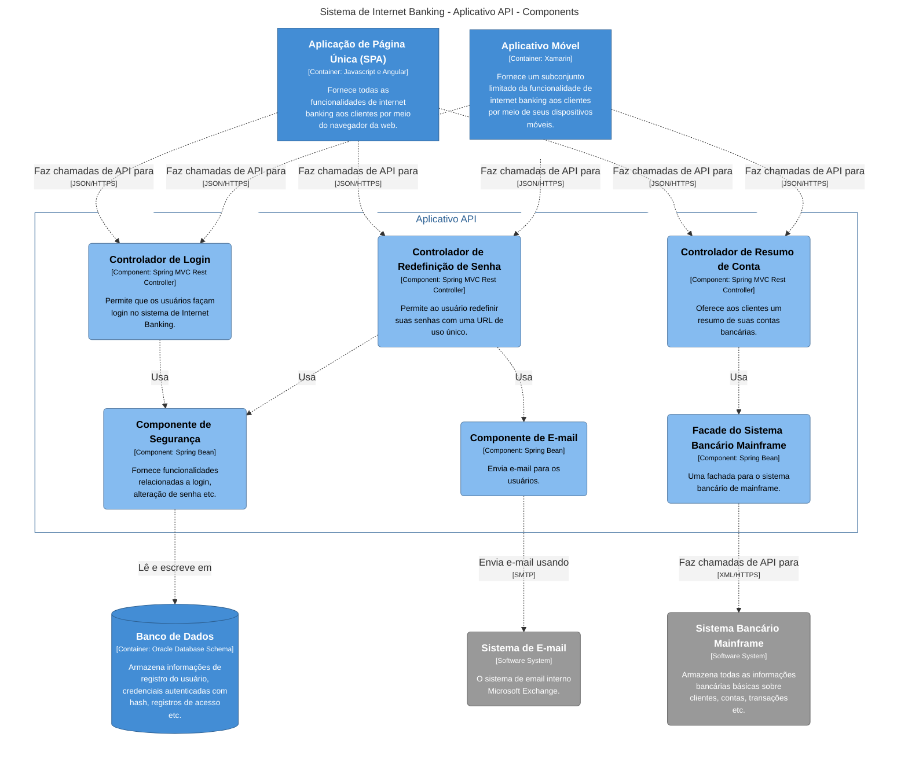
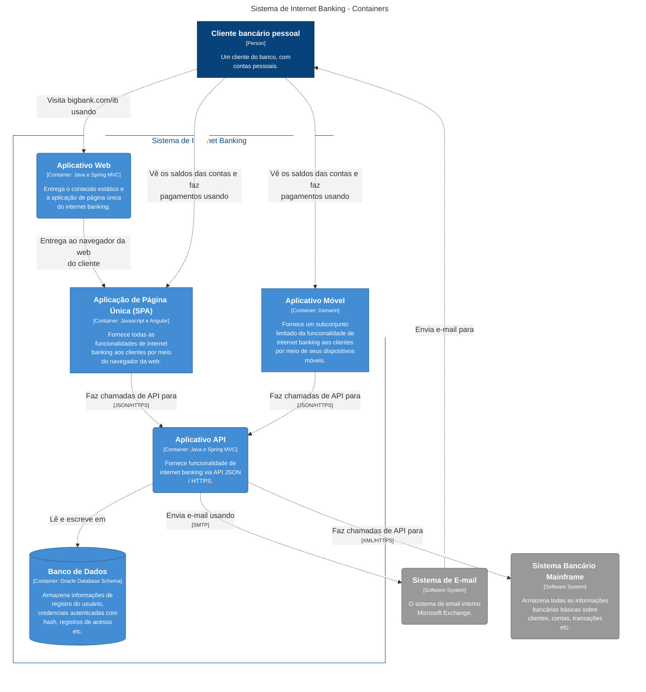
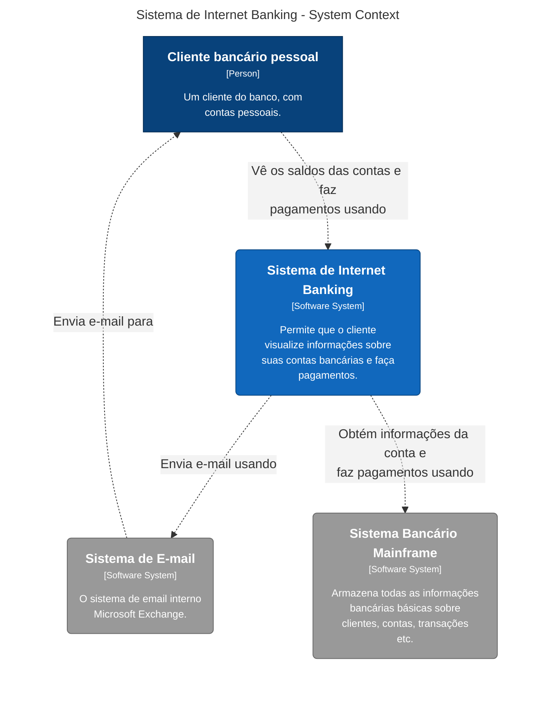

## Components

```mermaid
graph LR
  linkStyle default fill:#ffffff

  subgraph diagram ["Sistema de Internet Banking - Aplicativo API - Components"]
    style diagram fill:#ffffff,stroke:#ffffff

    4["<div style='font-weight: bold'>Aplicação de Página Única (SPA)</div><div style='font-size: 70%; margin-top: 0px'>[Container: Javascript e Angular]</div><div style='font-size: 80%; margin-top:10px'>Fornece todas as<br />funcionalidades de internet<br />banking aos clientes por meio<br />do navegador da web.</div>"]
    style 4 fill:#438dd5,stroke:#2e6295,color:#ffffff
    6["<div style='font-weight: bold'>Aplicativo Móvel</div><div style='font-size: 70%; margin-top: 0px'>[Container: Xamarin]</div><div style='font-size: 80%; margin-top:10px'>Fornece um subconjunto<br />limitado da funcionalidade de<br />internet banking aos clientes<br />por meio de seus dispositivos<br />móveis.</div>"]
    style 6 fill:#438dd5,stroke:#2e6295,color:#ffffff
    30[("<div style='font-weight: bold'>Banco de Dados</div><div style='font-size: 70%; margin-top: 0px'>[Container: Oracle Database Schema]</div><div style='font-size: 80%; margin-top:10px'>Armazena informações de<br />registro do usuário,<br />credenciais autenticadas com<br />hash, registros de acesso<br />etc.</div>")]
    style 30 fill:#438dd5,stroke:#2e6295,color:#ffffff
    33("<div style='font-weight: bold'>Sistema de E-mail</div><div style='font-size: 70%; margin-top: 0px'>[Software System]</div><div style='font-size: 80%; margin-top:10px'>O sistema de email interno<br />Microsoft Exchange.</div>")
    style 33 fill:#999999,stroke:#6b6b6b,color:#ffffff
    38("<div style='font-weight: bold'>Sistema Bancário Mainframe</div><div style='font-size: 70%; margin-top: 0px'>[Software System]</div><div style='font-size: 80%; margin-top:10px'>Armazena todas as informações<br />bancárias básicas sobre<br />clientes, contas, transações<br />etc.</div>")
    style 38 fill:#999999,stroke:#6b6b6b,color:#ffffff

    subgraph 11 [Aplicativo API]
      style 11 fill:#ffffff,stroke:#2e6295,color:#2e6295

      14("<div style='font-weight: bold'>Controlador de Login</div><div style='font-size: 70%; margin-top: 0px'>[Component: Spring MVC Rest Controller]</div><div style='font-size: 80%; margin-top:10px'>Permite que os usuários façam<br />login no sistema de Internet<br />Banking.</div>")
      style 14 fill:#85bbf0,stroke:#5d82a8,color:#000000
      17("<div style='font-weight: bold'>Controlador de Redefinição de Senha</div><div style='font-size: 70%; margin-top: 0px'>[Component: Spring MVC Rest Controller]</div><div style='font-size: 80%; margin-top:10px'>Permite ao usuário redefinir<br />suas senhas com uma URL de<br />uso único.</div>")
      style 17 fill:#85bbf0,stroke:#5d82a8,color:#000000
      20("<div style='font-weight: bold'>Controlador de Resumo de Conta</div><div style='font-size: 70%; margin-top: 0px'>[Component: Spring MVC Rest Controller]</div><div style='font-size: 80%; margin-top:10px'>Oferece aos clientes um<br />resumo de suas contas<br />bancárias.</div>")
      style 20 fill:#85bbf0,stroke:#5d82a8,color:#000000
      23("<div style='font-weight: bold'>Componente de Segurança</div><div style='font-size: 70%; margin-top: 0px'>[Component: Spring Bean]</div><div style='font-size: 80%; margin-top:10px'>Fornece funcionalidades<br />relacionadas a login,<br />alteração de senha etc.</div>")
      style 23 fill:#85bbf0,stroke:#5d82a8,color:#000000
      26("<div style='font-weight: bold'>Componente de E-mail</div><div style='font-size: 70%; margin-top: 0px'>[Component: Spring Bean]</div><div style='font-size: 80%; margin-top:10px'>Envia e-mail para os<br />usuários.</div>")
      style 26 fill:#85bbf0,stroke:#5d82a8,color:#000000
      28("<div style='font-weight: bold'>Facade do Sistema Bancário Mainframe</div><div style='font-size: 70%; margin-top: 0px'>[Component: Spring Bean]</div><div style='font-size: 80%; margin-top:10px'>Uma fachada para o sistema<br />bancário de mainframe.</div>")
      style 28 fill:#85bbf0,stroke:#5d82a8,color:#000000
    end

    4-. "<div>Faz chamadas de API para</div><div style='font-size: 70%'>[JSON/HTTPS]</div>" .->14
    6-. "<div>Faz chamadas de API para</div><div style='font-size: 70%'>[JSON/HTTPS]</div>" .->14
    4-. "<div>Faz chamadas de API para</div><div style='font-size: 70%'>[JSON/HTTPS]</div>" .->17
    6-. "<div>Faz chamadas de API para</div><div style='font-size: 70%'>[JSON/HTTPS]</div>" .->17
    4-. "<div>Faz chamadas de API para</div><div style='font-size: 70%'>[JSON/HTTPS]</div>" .->20
    6-. "<div>Faz chamadas de API para</div><div style='font-size: 70%'>[JSON/HTTPS]</div>" .->20
    14-. "<div>Usa</div><div style='font-size: 70%'></div>" .->23
    17-. "<div>Usa</div><div style='font-size: 70%'></div>" .->23
    17-. "<div>Usa</div><div style='font-size: 70%'></div>" .->26
    20-. "<div>Usa</div><div style='font-size: 70%'></div>" .->28
    23-. "<div>Lê e escreve em</div><div style='font-size: 70%'></div>" .->30
    26-. "<div>Envia e-mail usando</div><div style='font-size: 70%'>[SMTP]</div>" .->33
    28-. "<div>Faz chamadas de API para</div><div style='font-size: 70%'>[XML/HTTPS]</div>" .->38
  end
```

## Containers

```mermaid
graph LR
  linkStyle default fill:#ffffff

  subgraph diagram ["Sistema de Internet Banking - Containers"]
    style diagram fill:#ffffff,stroke:#ffffff

    1["<div style='font-weight: bold'>Cliente bancário pessoal</div><div style='font-size: 70%; margin-top: 0px'>[Person]</div><div style='font-size: 80%; margin-top:10px'>Um cliente do banco, com<br />contas pessoais.</div>"]
    style 1 fill:#08427b,stroke:#052e56,color:#ffffff
    33("<div style='font-weight: bold'>Sistema de E-mail</div><div style='font-size: 70%; margin-top: 0px'>[Software System]</div><div style='font-size: 80%; margin-top:10px'>O sistema de email interno<br />Microsoft Exchange.</div>")
    style 33 fill:#999999,stroke:#6b6b6b,color:#ffffff
    38("<div style='font-weight: bold'>Sistema Bancário Mainframe</div><div style='font-size: 70%; margin-top: 0px'>[Software System]</div><div style='font-size: 80%; margin-top:10px'>Armazena todas as informações<br />bancárias básicas sobre<br />clientes, contas, transações<br />etc.</div>")
    style 38 fill:#999999,stroke:#6b6b6b,color:#ffffff

    subgraph 2 [Sistema de Internet Banking]
      style 2 fill:#ffffff,stroke:#0b4884,color:#0b4884

      11("<div style='font-weight: bold'>Aplicativo API</div><div style='font-size: 70%; margin-top: 0px'>[Container: Java e Spring MVC]</div><div style='font-size: 80%; margin-top:10px'>Fornece funcionalidade de<br />internet banking via API JSON<br />/ HTTPS.</div>")
      style 11 fill:#438dd5,stroke:#2e6295,color:#ffffff
      30[("<div style='font-weight: bold'>Banco de Dados</div><div style='font-size: 70%; margin-top: 0px'>[Container: Oracle Database Schema]</div><div style='font-size: 80%; margin-top:10px'>Armazena informações de<br />registro do usuário,<br />credenciais autenticadas com<br />hash, registros de acesso<br />etc.</div>")]
      style 30 fill:#438dd5,stroke:#2e6295,color:#ffffff
      4["<div style='font-weight: bold'>Aplicação de Página Única (SPA)</div><div style='font-size: 70%; margin-top: 0px'>[Container: Javascript e Angular]</div><div style='font-size: 80%; margin-top:10px'>Fornece todas as<br />funcionalidades de internet<br />banking aos clientes por meio<br />do navegador da web.</div>"]
      style 4 fill:#438dd5,stroke:#2e6295,color:#ffffff
      6["<div style='font-weight: bold'>Aplicativo Móvel</div><div style='font-size: 70%; margin-top: 0px'>[Container: Xamarin]</div><div style='font-size: 80%; margin-top:10px'>Fornece um subconjunto<br />limitado da funcionalidade de<br />internet banking aos clientes<br />por meio de seus dispositivos<br />móveis.</div>"]
      style 6 fill:#438dd5,stroke:#2e6295,color:#ffffff
      8("<div style='font-weight: bold'>Aplicativo Web</div><div style='font-size: 70%; margin-top: 0px'>[Container: Java e Spring MVC]</div><div style='font-size: 80%; margin-top:10px'>Entrega o conteúdo estático e<br />a aplicação de página única<br />do internet banking.</div>")
      style 8 fill:#438dd5,stroke:#2e6295,color:#ffffff
    end

    8-. "<div>Entrega ao navegador da web<br />do cliente</div><div style='font-size: 70%'></div>" .->4
    4-. "<div>Faz chamadas de API para</div><div style='font-size: 70%'>[JSON/HTTPS]</div>" .->11
    6-. "<div>Faz chamadas de API para</div><div style='font-size: 70%'>[JSON/HTTPS]</div>" .->11
    11-. "<div>Lê e escreve em</div><div style='font-size: 70%'></div>" .->30
    33-. "<div>Envia e-mail para</div><div style='font-size: 70%'></div>" .->1
    11-. "<div>Envia e-mail usando</div><div style='font-size: 70%'>[SMTP]</div>" .->33
    11-. "<div>Faz chamadas de API para</div><div style='font-size: 70%'>[XML/HTTPS]</div>" .->38
    1-. "<div>Vê os saldos das contas e faz<br />pagamentos usando</div><div style='font-size: 70%'></div>" .->4
    1-. "<div>Vê os saldos das contas e faz<br />pagamentos usando</div><div style='font-size: 70%'></div>" .->6
    1-. "<div>Visita bigbank.com/ib usando</div><div style='font-size: 70%'></div>" .->8
  end
```

## SystemContext

```mermaid
graph LR
  linkStyle default fill:#ffffff

  subgraph diagram ["Sistema de Internet Banking - System Context"]
    style diagram fill:#ffffff,stroke:#ffffff

    1["<div style='font-weight: bold'>Cliente bancário pessoal</div><div style='font-size: 70%; margin-top: 0px'>[Person]</div><div style='font-size: 80%; margin-top:10px'>Um cliente do banco, com<br />contas pessoais.</div>"]
    style 1 fill:#08427b,stroke:#052e56,color:#ffffff
    2("<div style='font-weight: bold'>Sistema de Internet Banking</div><div style='font-size: 70%; margin-top: 0px'>[Software System]</div><div style='font-size: 80%; margin-top:10px'>Permite que o cliente<br />visualize informações sobre<br />suas contas bancárias e faça<br />pagamentos.</div>")
    style 2 fill:#1168bd,stroke:#0b4884,color:#ffffff
    33("<div style='font-weight: bold'>Sistema de E-mail</div><div style='font-size: 70%; margin-top: 0px'>[Software System]</div><div style='font-size: 80%; margin-top:10px'>O sistema de email interno<br />Microsoft Exchange.</div>")
    style 33 fill:#999999,stroke:#6b6b6b,color:#ffffff
    38("<div style='font-weight: bold'>Sistema Bancário Mainframe</div><div style='font-size: 70%; margin-top: 0px'>[Software System]</div><div style='font-size: 80%; margin-top:10px'>Armazena todas as informações<br />bancárias básicas sobre<br />clientes, contas, transações<br />etc.</div>")
    style 38 fill:#999999,stroke:#6b6b6b,color:#ffffff

    1-. "<div>Vê os saldos das contas e faz<br />pagamentos usando</div><div style='font-size: 70%'></div>" .->2
    33-. "<div>Envia e-mail para</div><div style='font-size: 70%'></div>" .->1
    2-. "<div>Envia e-mail usando</div><div style='font-size: 70%'></div>" .->33
    2-. "<div>Obtém informações da conta e<br />faz pagamentos usando</div><div style='font-size: 70%'></div>" .->38
  end
```

