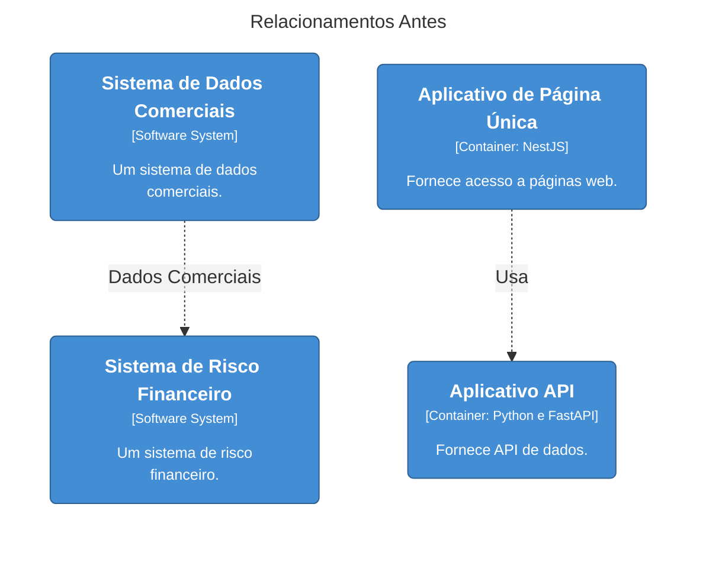
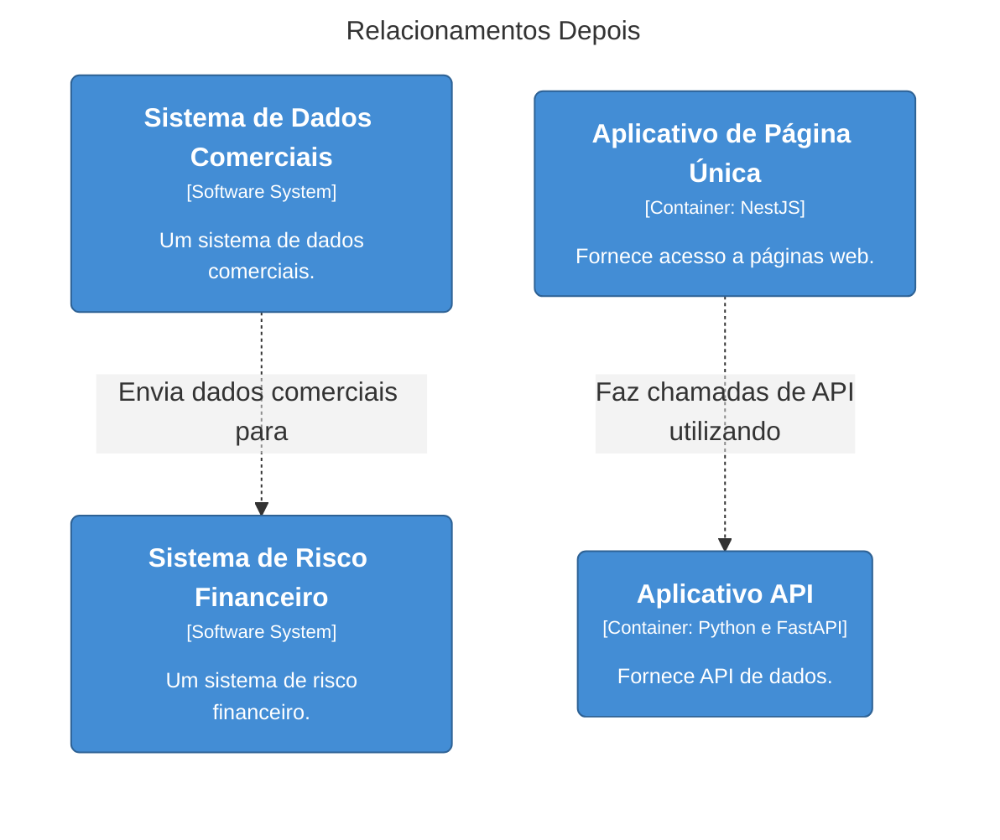

## RelacionamentosAntes

```mermaid
graph LR
  linkStyle default fill:#ffffff

  subgraph diagram ["Relacionamentos Antes"]
    style diagram fill:#ffffff,stroke:#ffffff

    1("<div style='font-weight: bold'>Sistema de Dados Comerciais</div><div style='font-size: 70%; margin-top: 0px'>[Software System]</div><div style='font-size: 80%; margin-top:10px'>Um sistema de dados<br />comerciais.</div>")
    style 1 fill:#438dd5,stroke:#2e6295,color:#ffffff
    2("<div style='font-weight: bold'>Sistema de Risco Financeiro</div><div style='font-size: 70%; margin-top: 0px'>[Software System]</div><div style='font-size: 80%; margin-top:10px'>Um sistema de risco<br />financeiro.</div>")
    style 2 fill:#438dd5,stroke:#2e6295,color:#ffffff
    5("<div style='font-weight: bold'>Aplicativo de Página Única</div><div style='font-size: 70%; margin-top: 0px'>[Container: NestJS]</div><div style='font-size: 80%; margin-top:10px'>Fornece acesso a páginas web.</div>")
    style 5 fill:#438dd5,stroke:#2e6295,color:#ffffff
    6("<div style='font-weight: bold'>Aplicativo API</div><div style='font-size: 70%; margin-top: 0px'>[Container: Python e FastAPI]</div><div style='font-size: 80%; margin-top:10px'>Fornece API de dados.</div>")
    style 6 fill:#438dd5,stroke:#2e6295,color:#ffffff

    1-. "<div>Dados Comerciais</div><div style='font-size: 70%'></div>" .->2
    5-. "<div>Usa</div><div style='font-size: 70%'></div>" .->6
  end
```

## RelacionamentosDepois

```mermaid
graph LR
  linkStyle default fill:#ffffff

  subgraph diagram ["Relacionamentos Depois"]
    style diagram fill:#ffffff,stroke:#ffffff

    1("<div style='font-weight: bold'>Sistema de Dados Comerciais</div><div style='font-size: 70%; margin-top: 0px'>[Software System]</div><div style='font-size: 80%; margin-top:10px'>Um sistema de dados<br />comerciais.</div>")
    style 1 fill:#438dd5,stroke:#2e6295,color:#ffffff
    2("<div style='font-weight: bold'>Sistema de Risco Financeiro</div><div style='font-size: 70%; margin-top: 0px'>[Software System]</div><div style='font-size: 80%; margin-top:10px'>Um sistema de risco<br />financeiro.</div>")
    style 2 fill:#438dd5,stroke:#2e6295,color:#ffffff
    5("<div style='font-weight: bold'>Aplicativo de Página Única</div><div style='font-size: 70%; margin-top: 0px'>[Container: NestJS]</div><div style='font-size: 80%; margin-top:10px'>Fornece acesso a páginas web.</div>")
    style 5 fill:#438dd5,stroke:#2e6295,color:#ffffff
    6("<div style='font-weight: bold'>Aplicativo API</div><div style='font-size: 70%; margin-top: 0px'>[Container: Python e FastAPI]</div><div style='font-size: 80%; margin-top:10px'>Fornece API de dados.</div>")
    style 6 fill:#438dd5,stroke:#2e6295,color:#ffffff

    1-. "<div>Envia dados comerciais para</div><div style='font-size: 70%'></div>" .->2
    5-. "<div>Faz chamadas de API<br />utilizando</div><div style='font-size: 70%'></div>" .->6
  end
```

